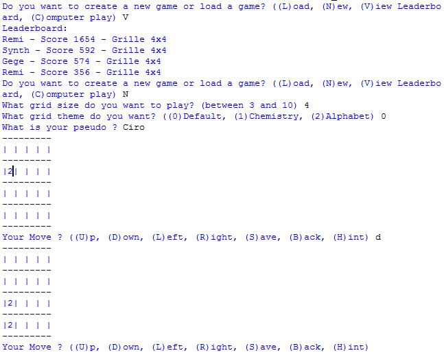
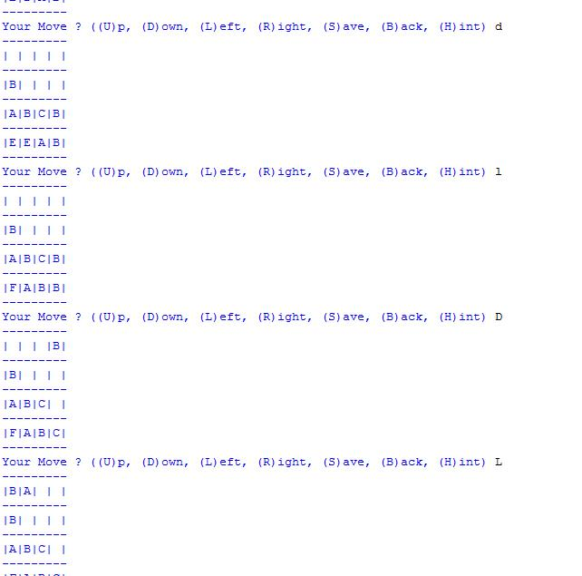
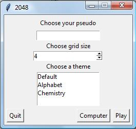

# 2048

## Introduction
Reproduction of 2048 mobile game with [Python3](https://www.python.org/downloads/)

Built for a school project

Only for personal use

## Textual version
To play with this version, execute `textual_2048.py` file in Idle
- [x] Basic game
- [x] Score
- [x] Save / Load Game
- [x] Theme
- [x] Leaderboard
- [x] Different grid size
- [x] Undo action
- [ ] Computer play
- [x] Application

## Graphical version
Graphical version use tkinter library, to play with this version, execute `graphical_2048.py` file in Idle
- [x] Basic game
- [x] Score
- [x] Save / Load Game
- [x] Theme
- [x] Leaderboard
- [x] Different grid size
- [x] Undo action
- [ ] Computer play
- [ ] Application

