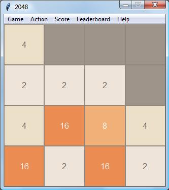

## Introduction
Reproduction du jeu mobile 2048 en utilisant [Python](https://www.python.org/downloads/).

Réalisé dans un but scolaire.

Seulement pour une utilisation personnelle.

## Manuel
Il y a deux versions disponibles, une version graphique utilisant le module Tkinter (Seulement pour des versions de Python supérieur à 3) 
et une version utlisant la console ou Idle. Pour lancer chacunes de ces deux versions, il faut tout d'abord ouvrir leur script dans Idle 
puis le lancer grâce la commande Execute
(Raccourci F5), la partie se lance automatiquement.

Concernant la version texte, pour relancer une partie, il vous faut relancer le script.

## Version "Console"
Pour jouer avec cette version, lancer le script `textual_2048.py` dans Idle.
#### Fonctionnalités
- [x] Jeu de base
- [x] Score
- [x] Sauvegarder / Charger une partie
- [x] Choix du thème
- [x] Classements
- [x] Différentes tailles de grilles
- [x] Retours arrières
- [x] Astuces
- [x] Jeu avec l'ordinateur

## Version graphique
Pour jouer avec cette version, lancer le script `graphical_2048.py` dans Idle.
- [x] Jeu de base
- [x] Score
- [x] Sauvegarder / Charger une partie
- [x] Choix du thème
- [x] Classements
- [x] Différentes tailles de grilles
- [x] Retours arrières
- [x] Astuces
- [x] Jeu avec l'ordinateur

